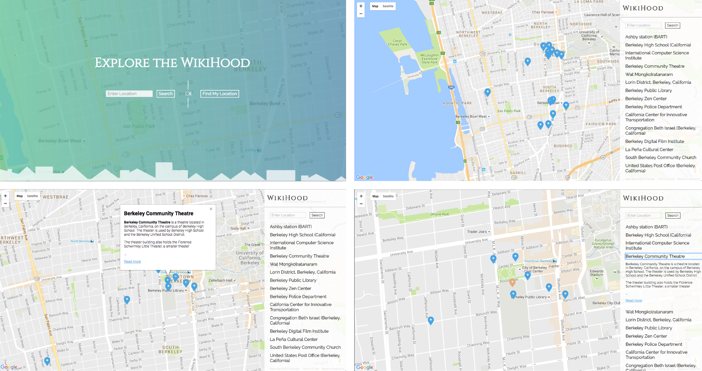
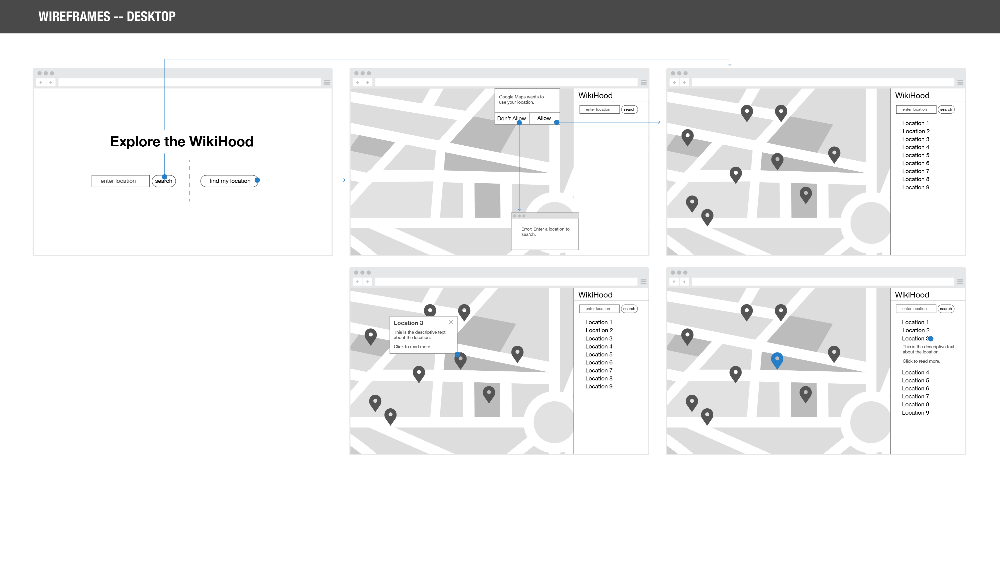
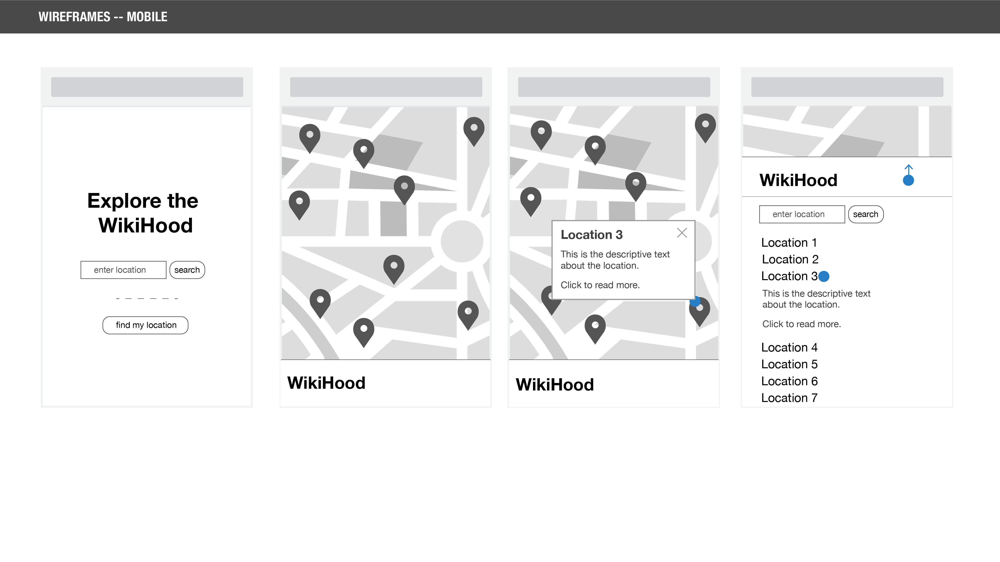

# WikiHood

Thinkful (https://www.thinkful.com/) Capstone 1 project: an app that integrates multiple APIs to allow users to explore locations through geocoded Wikipedia articles. 

## Introduction
WikiHood lets you explore the world around you through location-based Wikipedia articles. Enter in a location or share your own to discover notable landmarks, fascinating histories, and unexpected events right in your own backyard. You might be surprised what you’ll find in your WikiHood.

## Use Case
This app is particularly interesting for anyone who has ever gotten lost “down the wiki-hole”. WikiHood let’s you curate your Wikipedia browsing experience, while helping you learn new and fascinating things about your neighborhood. Planning a trip? WikiHood can be a resource to help you explore the quirky, less public history of the town you’re visiting. And with an easy-to-use geolocation feature, you can easily find interesting articles about your current location without having to input an address or zip code.

## UX
Wireframes for the early concepts for the landing page and main results pages are shown below for both desktop and mobile views. The blue icons indicate user touch points to navigate through and modify the screens.

## Live Site
You can access WikiHood at http://taypsl.github.io/explore-the-wikihood/

## Technical
- The app is built using HTML, CSS, and JavaScript
- The app is responsive, and adapts for desktop and mobile
- The app integrates with [Google Maps API](https://developers.google.com/maps/documentation/javascript/ "Google Maps API") and the [Wikipedia MediaWiki](https://www.mediawiki.org/wiki/API:Showing_nearby_wiki_information "Wikipedia MediaWiki") API
